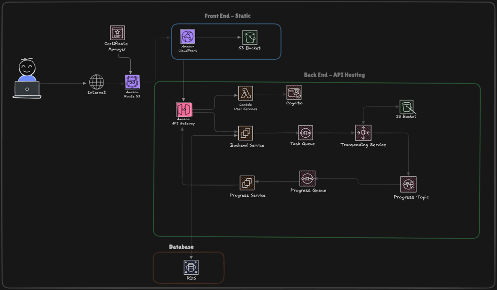

Diagram of the application architecture

Overview of the services:
-	User services: User services handle Cognito functionalities such as logging in, signing up, and sign-up confirmation and is hosted on a Lambda function triggered via API gateway.
-	Backend Service: The backend service handles API requests from the frontend and is mainly responsible for fetch data from RDS database and creating presigned URL and is hosted on an EC2 instance.
-	Transcoding service: The transcoding service handles transcoding video by receiving messages from the task SQS and is hosted on an EC2 instance as part of auto scaling group.
-	Progress service: The progress service sends progress information to the client via progress SQS which is subscribed to the progress SNS topic. This service uses EC2 as its compute.
-	Progress Topic: The SNS topic handles pub/sub communication between the progress service and transcoding service.
-	Task SQS: Task SQS stores video transcoding specifications like video filters, unique identifier for the task, as well as client information.
-	Progress SQS: Progress SQS stores the progress information of transcoding tasks like percentage. This service is subscribed to the Progress Topic and is polled by the Progress service to relay the progress information to the client via SSE. 
-	API Gateway: API gateway provides a single endpoint for all requests to the backend services.
-	RDS database: RDS is used to store structured data like video metadata, comments, playlists and likes. 
-	S3: S3 bucket is used to store user uploaded and transcoded videos as well as video thumbnail images. It is also utilized for storing static front-end files for edge caching.

Microservices Architecture: 

The application is divided into discrete microservices, each handling specific tasks such as user management, backend processing, and transcoding. This design ensures that each service can scale independently, a critical feature for applications that experience fluctuating loads on specific services (e.g., transcoding service might require more resources during high-traffic periods). Microservices also facilitate development, as each service can be developed, deployed, and maintained independently.
